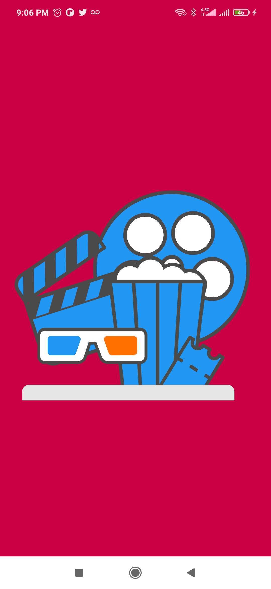
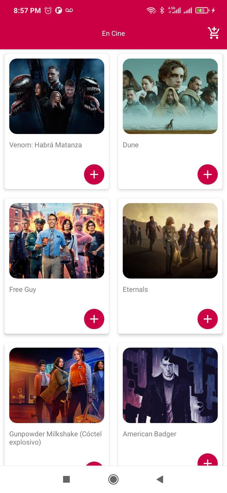
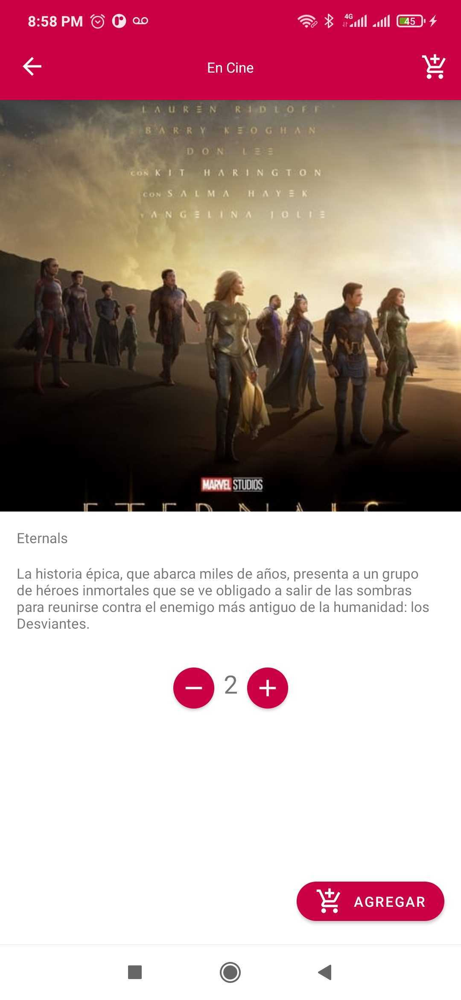
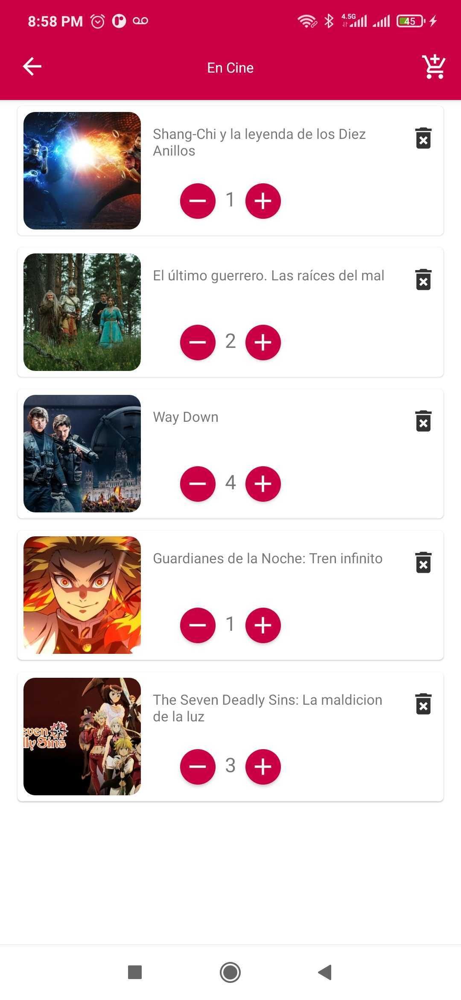

# Mi cine

Éste proyecto implementa Clean Architecture. Con esta aplicación los usuarios pueden ver todas las peliculas mas populares que se encuentran en cartelera.

## Implementaciones

Este proyecto contiene las siguientes características.

- MVVM architecture model
- LiveData
- Coroutines
- DataBinding
- Hilt DI
- Room
- Lottie
- Mockito testing

## Guía de implementación

### Trabajando con la API The Movie Database (TMDB)

Este proyecto implementa el API (TMDB). Para conocer más sobre su uso visita su página: https://www.themoviedb.org/

### Arquitectura

Este proyecto sigue buenas prácticas de la arquitectura limpia (Clean Architecture) planteada por Robert C. Martin para hacer un código más independiente, 
mantenible y sencillo para generar pruebas unitarias.

#### Capas

* UI: Se encarga de presentar los datos al usuario
* View Models: se encargar de conectar el modelo con la vista UI, utilizando LiveData este puede estar pendiente de los cambios y mantener la vista actualizada librandola de cualquier 
  responsabilidad de logica
* Dominio: MOvie, responseMOvie.
* Datos: Los datos son proporcionados por MoviesRepository al ViewModel, ya que se pueden tener varias entradas de datos en este caso Retrofit y Room

Este proyecto usa ViewModel para almacenar y manejar datos, así como comunicar cambios hacia la vista.

Este proyecto usa LiveData para manejar la navegación y los valores en la aplicación.

### Deep Link

El deep link se contruyo utilizando navigate, lo que facilita su contruccion y manejo de navegacion dentro del app, este puede ser accedido desde el siguinte enlace.

* www.movie.lino.com/shopCart

### Persistencia de datos - Room

Este proyecto utiliza Room para salvar el listado de peliculas y carrito de compras para que si tener coexion este pueda seguir utilizando el app.

### Administrador de solicitudes: Retrofit

Este proyecto utiliza Retrofit para proporcionar una lista de peliculas y su información desde una API.

### Biblioteca de imágenes - Glide

Este proyecto utiliza Glide para cargar las imágenes de las peliculas. Para el uso de placeholders se manejan íconos proporcionados por la página de Material Design (https://material.io/resources/icons/).

### Inyección de dependencia - Dagger-Hilt

Este proyecto utiliza Dagger-Hilt para gestionar la inyección de dependencia.

## Capturas de pantalla

  
  
  
  

